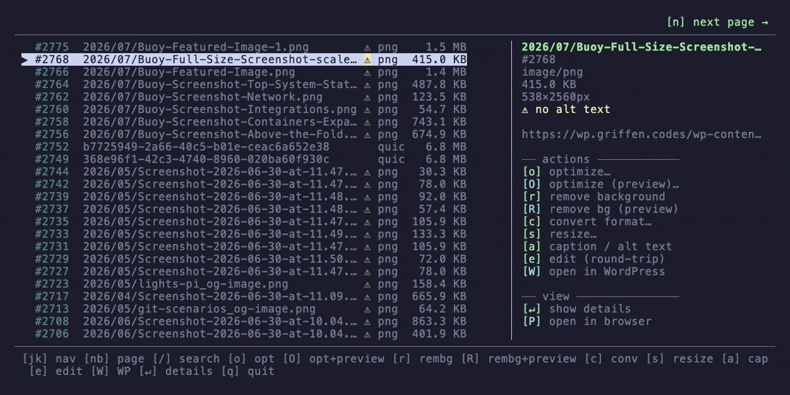

# localpress

[](https://github.com/gfargo/localpress/releases)
[](https://github.com/gfargo/homebrew-tap)
[](LICENSE)
[](https://github.com/gfargo/localpress/issues)
[](https://github.com/gfargo/localpress/pulls)
[](https://github.com/gfargo/localpress/tree/main)
[](https://github.com/gfargo/localpress/actions/workflows/ci.yml)
[](https://github.com/sponsors/gfargo)

> Your laptop, your library.

Local-compute WordPress management CLI. Optimize media, manage posts and pages, audit accessibility, generate AI alt-text, remove backgrounds — all on your hardware. Syncs to your remote WordPress site via the REST API. No recurring credits. No cloud SaaS. No plugin required.

**[Website](https://localpress.griffen.codes)** · **[Docs](https://localpress.griffen.codes/docs)** · **[Wiki](https://github.com/gfargo/localpress/wiki)** · **[Releases](https://github.com/gfargo/localpress/releases)**

<p align="center">
  
</p>
<p align="center">
  
</p>

---

## Install

### Homebrew (macOS / Linux)

```bash
brew install gfargo/tap/localpress
```

### Pre-built binaries

Download from the [releases page](https://github.com/gfargo/localpress/releases). Available for macOS (arm64/x64), Linux (arm64/x64), and Windows (x64).

### From source

Requires [Bun](https://bun.sh) >= 1.1.0:

```bash
git clone https://github.com/gfargo/localpress.git && cd localpress
bun install && bun run dev -- --help
```

---

## Quick start

```bash
# 1. Connect your WordPress site
localpress init

# 2. Audit your media library
localpress audit

# 3. Optimize everything
localpress optimize --unoptimized --apply

# 4. Generate alt text for accessibility
localpress caption --missing-alt --apply
```

---

## What it does

```bash
# Compress images (sharp + jSquash WASM codecs)
localpress optimize 123 124 125
localpress optimize --unoptimized --profile hero --apply

# Convert formats (JPEG → WebP → AVIF)
localpress convert 123 --to webp

# Resize preserving aspect ratio
localpress resize 123 --max-width 1920

# Remove backgrounds with local AI (5 ONNX models including BiRefNet)
localpress remove-bg 123 --model birefnet-lite --preview

# Generate alt text with local Ollama vision model
localpress caption --missing-alt --language Spanish --apply

# Open in GIMP/Photoshop/Preview, save, auto-sync back
localpress edit 123

# Export your entire library for migration
localpress export --all --to ./backup.zip

# Import with optimization on upload
localpress import ./photos/ --optimize --to webp

# Find where an attachment is used
localpress references 1234

# Set metadata directly
localpress metadata 123 --alt "Product photo on white background"

# Watch a directory and auto-push new images
localpress watch ./assets/images --optimize

# Manage posts and pages (including custom post types)
localpress posts list --type portfolio
localpress posts create --title "New Post" --content-file ./draft.html --status draft
localpress posts update 456 --status publish

# Accessibility audit
localpress a11y
```

---

## 38+ commands

| Category | Commands |
|----------|----------|
| **Setup** | `init`, `sites`, `doctor`, `config` |
| **Discovery** | `list`, `show`, `stats`, `audit`, `references` |
| **Processing** | `optimize`, `convert`, `resize`, `remove-bg`, `caption`, `metadata` |
| **AI Vision** | `title`, `describe`, `classify`, `tag`, `vision`, `rename` |
| **Content** | `posts list/show/create/update/delete` |
| **Accessibility** | `a11y` |
| **Migration** | `export`, `import` |
| **Automation** | `watch` |
| **Server-side** | `regenerate` |
| **Round-trip** | `edit` |
| **Low-level** | `pull`, `push`, `delete` |
| **Time-machine** | `history`, `undo` |
| **Maintenance** | `update`, `completions` |

All commands accept `--json` for machine-readable output and `--help` for usage details.

---

## AI agent integration (MCP)

localpress ships a built-in [Model Context Protocol](https://modelcontextprotocol.io) server with 40+ typed tools. Add it to any MCP host:

```jsonc
// Claude Desktop, Cursor, VS Code, Kiro, etc.
{
  "mcpServers": {
    "localpress": { "command": "localpress", "args": ["mcp"] }
  }
}
```

The agent gets typed schemas for every operation — optimize, caption, posts CRUD, accessibility audit, remove-bg, export/import, delete, undo, and more.

Structured JSON results, capability discovery via resources, and concurrency control on all bulk operations.

A markdown **skill** (`skill/SKILL.md`) is also available for agents that prefer shelling out to the CLI directly.

---

## Key behaviors

- **Safe by default** — bulk ops (`--all`, `--unoptimized`) dry-run unless `--apply` is passed. Explicit IDs execute immediately.
- **Idempotent** — re-running optimize on an already-processed attachment is a no-op (SHA-256 hash comparison).
- **Always undoable** — every destructive op snapshots the original. Restore with `localpress undo`.
- **Named profiles** — `localpress config set-profile hero --quality 75 --format webp --max-width 1920` then `optimize --profile hero`.
- **Replace-in-place** — tries WP-CLI over SSH first, falls back gracefully. `--strict` fails instead of falling back.
- **Two encoders** — sharp (default, native libvips) or jSquash WASM codecs (`--encoder jsquash`) for OxiPNG-level PNG compression.
- **Multilingual captions** — `caption --language French` generates alt text in any language the Ollama model supports.
- **Posts & pages** — full CRUD for posts, pages, and custom post types. Create drafts, publish, update content, manage categories/tags.
- **Accessibility audit** — `a11y` checks heading hierarchy, generic link text, missing img alt, and empty links across all published content.

---

## Architecture

```text
┌──────────────────┐    ┌──────────────────┐    ┌─────────────────┐
│  MCP Server (40+ │───▶│  localpress CLI  │───▶│  Remote WP site │
│  tools) / Skill  │    │  (TS + Bun)      │    │  (REST / SSH)   │
└──────────────────┘    └──────────────────┘    └─────────────────┘
                                │
                        ┌───────┴────────┐
                        │  Engine layer  │
                        │  sharp/jsquash │
                        │  ONNX Runtime  │
                        │  Ollama vision │
                        │  SQLite state  │
                        └───────┬────────┘
                        ┌───────┴────────┐
                        │ Adapter layer  │
                        │ REST | WP-CLI  │
                        └────────────────┘
```

---

## Background removal models

| Model | Size | Quality | License |
|-------|------|---------|---------|
| `birefnet-lite` | ~224 MB | State-of-the-art | MIT |
| `isnet-general-use` | ~176 MB | Great edges | Apache-2.0 |
| `u2net` (default) | ~176 MB | General purpose | Apache-2.0 |
| `silueta` | ~44 MB | Balanced | MIT |
| `u2netp` | ~4.7 MB | Fast | Apache-2.0 |

Models download on first use. Use `--preview` to adjust in the browser before applying. Or pass `--rembg` to use system Python rembg instead.

---

## Alt-text generation

Requires [Ollama](https://ollama.com) running locally with a vision model:

```bash
ollama pull moondream    # ~1.7 GB, fast
localpress caption --missing-alt --apply
```

No cloud API. No credits. No data leaves your machine. Supports `--language` for non-English output and `--model` to choose between installed vision models.

---

## Development

```bash
bun install              # install deps
bun run dev -- --help    # run CLI from source
bun run typecheck        # tsc --noEmit
bun run lint             # biome check
bun test                 # 191+ unit tests + integration
bun run build:all        # build tarballs for all 5 platforms
```

---

## Links

- [Website & docs](https://localpress.griffen.codes)
- [Wiki](https://github.com/gfargo/localpress/wiki)
- [v2.0 announcement](docs/blog-post-v2.md)
- [Roadmap ideas](docs/roadmap-ideas.md)
- [Homebrew formula](Formula/localpress.rb)
- [CLAUDE.md](CLAUDE.md) — implementation status and conventions

---

## License

MIT. See [`LICENSE`](LICENSE).
